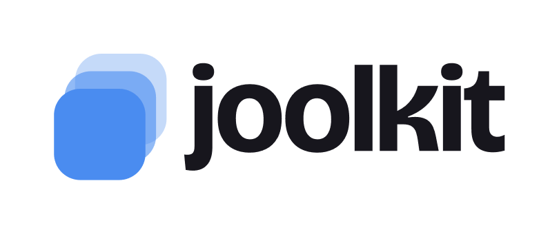

<p align="center">
  <picture>
    <source media="(prefers-color-scheme: dark)" srcset="client/src/assets/logo/png/joolkit-horizontal-light.png" />
    
  </picture>
</p>

<p align="center">
  <strong>Every application, under your control.</strong>
</p>

<p align="center">
  The job application toolkit. It brings the repetitive parts of job hunting into one<br />
  streamlined workspace, so you apply faster without retyping, and without handing your<br />
  applications to an opaque auto-apply bot.
</p>

<p align="center">
  
  
  
  
  
  
</p>

<p align="center">
  <code>Free to start</code> · <code>Desktop-first</code> · <code>No card required</code>
</p>

---

## Four tools. One workflow.

Everything repetitive about applying to jobs, handled. You still control every application.

| Tool                    | What it does                                                                                                                |
| ----------------------- | --------------------------------------------------------------------------------------------------------------------------- |
| **Quick Copy**          | Your details, links, and frequently used files. One click to copy exactly the right thing into any form.                    |
| **Cover Letter Editor** | Start from your own templates, switch variations, and replace tokens automatically. Export a clean PDF.                     |
| **Answer Bank**         | Save short and long-form answers once, tag and search them, then drop the perfect response into any application in seconds. |
| **Application Tracker** | Keep every role, status, location, and deadline in one organized table you actually maintain.                               |

## How it works

Three steps. No bots applying on your behalf, just less busywork.

1. **Set up your kit once** — Add your details, links, reusable answers, and cover-letter templates. A few minutes, one time.
2. **Apply faster** — Copy the right info and tailor a cover letter in seconds with token replacement. No more retyping.
3. **Track everything** — Log each role and keep statuses, deadlines, and notes in one organized table.

## Tech stack

A TypeScript monorepo managed with pnpm workspaces and Turborepo.

- **Frontend** — React 19, Vite, Tailwind CSS v4, shadcn/ui (Radix UI), Tiptap 3, TanStack Query, React Router 7, dnd-kit
- **Backend** — Node.js 24, Express 5, Supabase (Postgres · Auth · Storage), Stripe, Puppeteer Core + Sparticuz Chromium for server-side PDF export
- **Tooling** — Vitest, Testing Library, MSW, ESLint, Prettier, Husky + lint-staged
- **Infrastructure** — Vercel (static client + serverless API), Supabase

## Project structure

```
joolkit/
├── client/      React app — marketing landing page + product workspace
├── server/      Express API — auth-guarded routes, billing, PDF export
├── api/         Vercel serverless entry that wraps the Express app
└── supabase/    Database migrations and configuration
```

## License

Licensed under the [Elastic License 2.0](LICENSE). You're free to view and learn from the code, but you may not offer it as a hosted or managed service.
